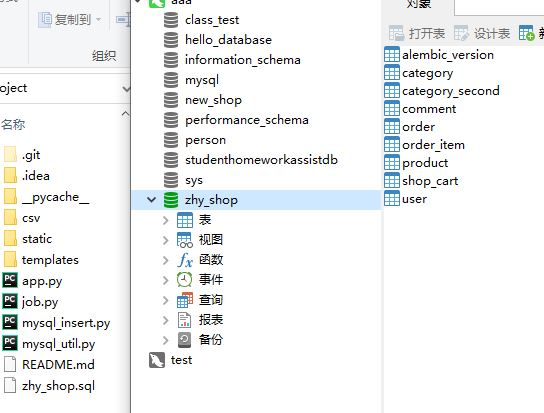

介绍
使用flask开的一个商场网站，具有注册登录，数据库管理，商品管理包括添加商品，删除商品，查询商品，商品可视化管理。
该项目在基础上开发，其中参考前端部分。
https://gitee.com/zou-haoyang/my_python_project
< br >
数据可视化参考：
https://gitee.com/mhtccc/51job_visualization
< br >
软件架构
工具：Pycharm, XAMPP Control Panel, navicat
需要的软件：Flask, Flask-SQLAlchemy
使用命令行导出
pip freeze > requirements.txt
安装使用
pip install –r requirements.txt
安装教程
1.	导出数据库sql文件 
  
2.	新建数据库shop
 
 
3.	导入sql文件
 
  

运行目录下的app.py文件

使用说明
1.	登录注册

注册用户
 
登录功能
 
 

2.	商品管理，以及商品来自数据库管理
 
 
 
3.	商品可视化管理
 

参与贡献
广东科学技术职业学院 计算机学院 人工智能应用技术专业 邹浩洋

